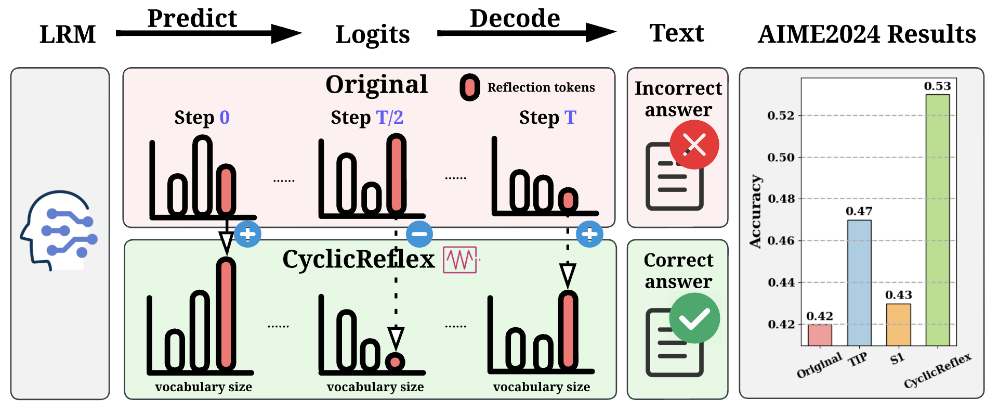

<div align='center'>
 
# CyclicReflex: Improving Large Reasoning Models via Cyclical Reflection Token Scheduling

[]()
[](https://github.com/OPTML-Group/CyclicReflex/issues)
[](https://github.com/OPTML-Group/CyclicReflex?tab=MIT-1-ov-file)
[](https://github.com/OPTML-Group/CyclicReflex)
[](https://github.com/OPTML-Group/CyclicReflex)
[](https://github.com/OPTML-Group/CyclicReflex)
</div>

<table align="center">
  <tr>
    <td align="center"> 
       
      <br>
      <em style="font-size: 18px;">  <strong style="font-size: 18px;">Figure 1:</strong> Schematic overview of CyclicReflex. The
rightmost subfigure presents a comparison of final answer accuracy between
CyclicReflex, the original LRM, and decoding
variants using TIP and S1.</em>
    </td>
  </tr>
</table>

This is the official code repository for the paper [CyclicReflex: Improving Large Reasoning Models via Cyclical Reflection Token Scheduling]().

## Abstract
Large reasoning models (LRMs), such as OpenAI's o1 and DeepSeek-R1, harness test-time scaling to perform multi-step reasoning for complex problem-solving. This reasoning process, executed before producing final answers, is often guided by special juncture tokens or textual segments that prompt self-evaluative reflection. We refer to these transition markers and reflective cues as "reflection tokens" (e.g., "wait", "but", "alternatively"). In this work, we treat reflection tokens as a "resource" and introduce the problem of resource allocation, aimed at improving the test-time compute performance of LRMs by adaptively regulating the frequency and placement of reflection tokens. Through empirical analysis, we show that both excessive and insufficient use of reflection tokens, referred to as over-reflection and under-reflection, can degrade model performance. To better understand and manage this trade-off, we draw an analogy between reflection token usage and learning rate scheduling in optimization. Building on this insight, we propose cyclical reflection token scheduling (termed CyclicReflex), a decoding strategy that dynamically modulates reflection token logits using a position-dependent triangular waveform. Experiments on MATH500, AIME2024/2025, and AMC2023 demonstrate that CyclicReflex consistently improves performance across model sizes (1.5B-8B), outperforming standard decoding and more recent approaches such as TIP (thought switching penalty) and S1.

## Getting Started

* [Overall performance of CyclicReflex.](Base)
* [Integration with other test-time scaling methods.](TestTimeScaling)


## Contributors
* [Chongyu Fan](https://chongyu-fan.netlify.app/)

## Cite This Work
```

```